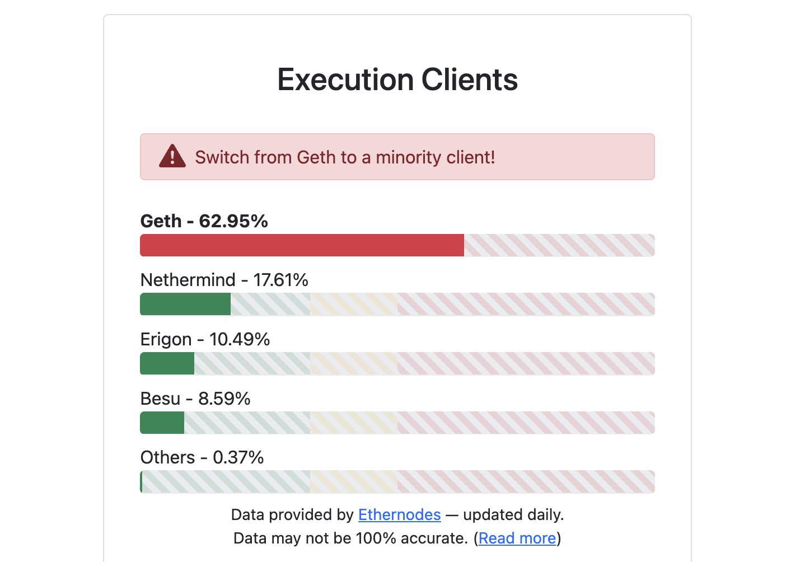
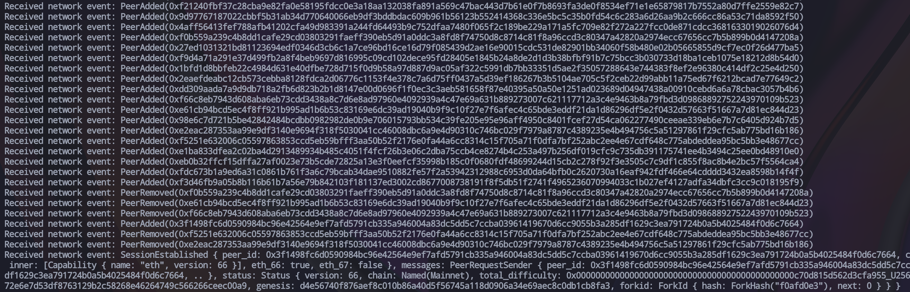
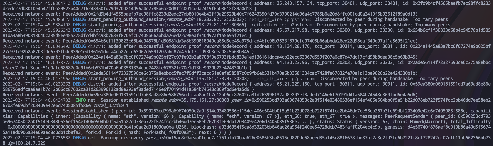
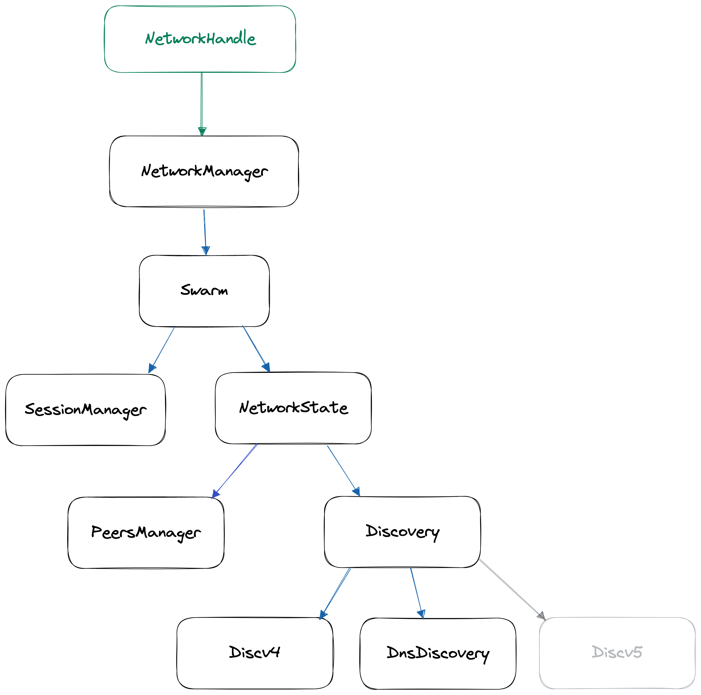

Recently, the engineering team at Paradigm [unveiled](https://www.paradigm.xyz/2022/12/reth) a new open-source execution client 
called **[Reth](https://github.com/paradigmxyz/reth)**. In short, reth aims to be an execution client to serve a large 
user base, including **power users** like MEV searchers, RPC node operators, block builders, and more. It will do so by making reth highly 
performant, but also very configurable, so that users can tweak and tune the settings to find the optimal setup 
for their use case. No other execution client is doing this, so this is big positive for the space.

<!-- truncate -->



Aside from this and the fact that [client diversity](https://clientdiversity.org/#distribution) is crucial, 
reth aims to accomodate developers as well. 
**Every part of the reth stack will be modular enough to use as a standalone component in your stack**. 
In their article, Paradigm mentions the blazing-fast database bindings that indexing companies could use, 
and that their EVM can be leveraged by [ERC4337](https://eips.ethereum.org/EIPS/eip-4337) bundlers to run fast simulations. 
In this article, we’ll talk about the architecture and usage of the networking stack, which plays an important role in [Fiber Network](https://fiber.chainbound.io).

:::info
💡 When I’m referencing reth code, you will find a Github permalink in the footnotes. 

All the example code (including dependencies and versions) can be found at [https://github.com/jonasbostoen/reth-p2p-showcase](https://github.com/jonasbostoen/reth-p2p-showcase).
:::info

## Showcase

We don’t just want to tell you about how great it is, we want to show you. Below is a Rust code snippet of how you can spin up a minimal [devp2p](https://github.com/ethereum/devp2p) node and listen to network events:

```rust title="examples/simple.rs"
use secp256k1::{rand, SecretKey};
use std::sync::Arc;
use tokio_stream::StreamExt;

use reth_network::{NetworkConfig, NetworkManager};
use reth_provider::test_utils::NoopProvider;

#[tokio::main]
async fn main() -> anyhow::Result<()> {
    // Generate a random ECDSA private key.
    let secret = SecretKey::new(&mut rand::thread_rng());

    // Create the network builder with the secret key, which allows you to configure the network.
    // The defaults will do for now, but we'll disable DNS discovery
		// and specify the bootnodes discv4 should use for discovering peers.
		let builder = NetworkConfig::<NoopProvider>::builder(secret)
        .disable_dns_discovery()
        .boot_nodes(mainnet_nodes());

    // Build the config. The configuration needs a client to interact with the chain (to respond to block header
    // and block bodies requests), but for now we'll just use a no-op client.
    let config = builder.build(Arc::new(NoopProvider::default()));
    let network = NetworkManager::new(config).await?;

    // Get a handle to the network manager
    let network_handle = network.handle().clone();
    // Subscribe to network events
    let mut network_events = network_handle.event_listener();
    println!("Starting network manager...");
    // Spawn the network manager task. This will start the network manager
    // and all the subcomponents necessary for the devp2p stack.
    tokio::spawn(network);

    while let Some(net_event) = network_events.next().await {
        println!("Received network event: {:?}", net_event);
    }

    Ok(())
}
```
All of the complexities of discovery, peer and session management, and message handling are nicely bundled inside of the `NetworkManager`. We'll cover
that in more details below, but for now, you can just run it with
```
cargo r --example simple
```

After a while you should start to see network events like `PeerAdded`, `PeerRemoved`, `SessionEstablished` and `SessionClosed`[^1]:



Note that this is a very minimal example and you won’t be able to maintain any peering connections, because for that, we would need to respond to `eth` protocol 
requests like [`GetBlockHeaders`](https://github.com/ethereum/devp2p/blob/master/caps/eth.md#getblockheaders-0x03) and [`GetBlockBodies`](https://github.com/ethereum/devp2p/blob/master/caps/eth.md#getblockbodies-0x05), 
which we can only do if we provide a valid chain provider (instead of `NoopProvider`).

This doesn’t give us a lot of information though. Reth uses the `tracing` library for logging events, 
which we can activate with the `RUST_LOG` environment variable.

If we run our binary with `RUST_LOG` set to `trace`, `debug` or `info`, we can see a lot more of what’s happening under the hood:
```
RUST_LOG=debug cargo r --example simple
```



If you want to zoom in on certain trace targets you can do so by tuning the `RUST_LOG` variable, for example, 
setting it to `RUST_LOG=discv4=trace,net=info`.

### Creating our own message handlers

We were able to run a minimally functional devp2p node in about 20 lines of code, which is impressive. But let’s take a look at what else the modular design allows us to do. 
In this following example, we’ll set the basis for providing custom handlers for `eth` protocol messages like `GetBlockHeaders` and `GetBlockBodies`, 
but also for the transaction exchange messages:

- `PooledTransactionHashes`
- `Transactions`
- `PooledTransactions`

This could be useful if you want to route `eth` sync requests to another location (say you’re running this as a sentry and want to relay requests to another node that keeps the actual blockchain state). 
Or you want to build your own transaction pool logic so you need access to all the transaction messages you’re receiving from the network. We can do this by using the `set_eth_request_handler` and `set_transactions` methods on our `NetworkManager` like so:

```rust title="examples/custom_handlers.rs"
use reth_p2p::init_tracing;
use secp256k1::{rand, SecretKey};
use std::sync::Arc;
use tokio::sync::mpsc;
use tokio_stream::StreamExt;

use reth_discv4::bootnodes::mainnet_nodes;
use reth_network::{NetworkConfig, NetworkManager, PeersConfig};
use reth_provider::test_utils::NoopProvider;

#[tokio::main]
async fn main() -> anyhow::Result<()> {
    init_tracing();
    // Generate a random ECDSA private key.
    let secret = SecretKey::new(&mut rand::thread_rng());

    // // Create a peer configuration with max 10 outbound and 10 inbound peers.
    let peer_config = PeersConfig::default()
        .with_max_outbound(10)
        .with_max_inbound(10);

    // Add the peer configuration here.
    let builder = NetworkConfig::<NoopProvider>::builder(secret)
        .disable_dns_discovery()
        .boot_nodes(mainnet_nodes())
        .peer_config(peer_config);

    // Build the config. The configuration needs a client to interact with the chain (to respond to block header
    // and block bodies requests), but for now we'll just use a no-op client.
    let config = builder.build(Arc::new(NoopProvider::default()));
    let mut network = NetworkManager::new(config).await?;

    // Create the channels for receiving eth messages
    let (eth_tx, mut eth_rx) = mpsc::unbounded_channel();
    let (transaction_tx, mut transaction_rx) = mpsc::unbounded_channel();

    network.set_eth_request_handler(eth_tx);
    network.set_transactions(transaction_tx);

    let network_handle = network.handle().clone();
    let mut network_events = network_handle.event_listener();
    println!("Starting network manager...");
    tokio::spawn(network);

    loop {
        tokio::select! {
            Some(tx_event) = transaction_rx.recv() => {
                println!("New transaction event: {:?}", tx_event);
            }

            Some(eth_req) = eth_rx.recv() => {
                println!("New eth protocol request: {:?}", eth_req);
            }

            Some(net_event) = network_events.next() => {
                println!("New network event: {:?}", net_event);
            }
        }
    }
}
```

When you run the `custom_handlers` example now, you will occasionally see these messages printed out. Note that in this example, 
I’ve also used a custom peer configuration that specifies the maximum number of outbound and inbound peers. 
Now that we have a very slim idea of what we can do with `reth-network`, let’s have a closer look at the architecture before looking at some more options.

## Architecture
At a high level, the p2p stack is implemented as a hierarchy of [state machines](https://en.wikipedia.org/wiki/Finite-state_machine) where parents pass events down to their children, and children bubble up events to their parents. 
`NetworkManager`[^2] is the entry point of this whole hierarchy, and it is implemented as an endless [future](https://rust-lang.github.io/async-book/02_execution/02_future.html). 
When we spawn the manager with `tokio::spawn(network)`, we let the tokio runtime drive the state of the manager forward. 
The runtime continually calls `poll`[^3], which in turn polls all the underlying components, all the way down the hierarchy. 
This mechanism is how the events bubble up and work is performed[^4]. The architecture in a diagram looks like this:



`Discv5` is greyed out because it’s still in the works. One thing we’ve seen in the code but haven’t talked about yet is the `NetworkHandle`, which we got with `network.handle().clone()`. This is a thread-safe, clonable handle that can be used to communicate with the network manager and all of the other components it manages. 
If you look at the whole reth codebase, you’ll see that this handle is shared between all the different subsystems that need access to the network, like the state syncer. 
This pattern is somewhat similar to the [actor pattern](https://ryhl.io/blog/actors-with-tokio/).

For us, it also has a very interesting interface. We can use it to broadcast transactions or transaction announcements, add and remove (trusted) peers, change peer reputation, and so on. 
Take a look at [this file](https://github.com/paradigmxyz/reth/blob/24bc633bbda05de0772c66b851af83c63a028144/crates/net/network/src/network.rs) for more information. 
We won’t cover what each component does in too much depth, since that’s already being done in the [reth developer docs](https://github.com/paradigmxyz/reth/tree/main/docs).

### Peer lifecycle

Let’s take a look at the lifecycle of a peer in the networking stack, because this will involve every component we’ve outlined above. 
Specifically, we’ll look at outbound connections, because it's a more complex process.

`Discovery`[^5] is the service responsible for discovering peers. It currently envelops 2 subsystems: `Discv4`[^6] and `DnsDiscovery`[^7], with `Discv5` in the [pipeline](https://github.com/paradigmxyz/reth/issues/1383). 
If you want to dive deeper into how these mechanisms work, see the links in the footnotes. Discovering a peer is the first step in the peer lifecycle. 
In short, the discovery service queries other nodes over UDP for their neighbors, starting with the pre-defined bootstrap nodes. The nodes in a response message
are queried in turn, and so on, so that our node gradually builds up a picture of the network. Every node undergoes a couple of checks, and if passed, is considered a newly discovered node.

Once a new node is discovered, the discovery service will bubble up an event with the information of the peer to the `NetworkState`[^8], which in turn notifies the `Swarm`[^9]. 
The `Swarm` in then does an [EIP-2124](https://eips.ethereum.org/EIPS/eip-2124) fork ID check. If this check passes, the `Swarm` adds the peer to the `PeerManager`, where it will sit as a candidate to be dialed[^10].

Depending on wether there are any outbound peer slots available, the peer will be bubbled up as a dial candidate to the `Swarm` again. 
This time, it will pass it down to `SessionManager` to start an outbound session with[^11]. 
Specifically, the `Swarm` calls [`dial_outbound`](https://github.com/paradigmxyz/reth/blob/f9de425ad895279c24a72977ffd0c6973afaf90e/crates/net/network/src/session/mod.rs#L215), 
which will try to establish a session with the peer by running the [RLPx](https://github.com/ethereum/devp2p/blob/master/rlpx.md) and [eth](https://github.com/ethereum/devp2p/blob/master/caps/eth.md) protocol handshakes. 
Once these handshakes pass, the peer will move from the pending to the active state, 
and a new `ActiveSession` will be created, which wraps the underlying RLPx and `eth` connection with said peer[^12]. 
The `SessionManager` keeps track of all these sessions, and notifies its parents about any messages, like transactions or block header requests.

We’ve skipped over some parts of the work involved, but hopefully you now have some idea about how these components interact, and how there is a clean [seperation of concerns](https://en.wikipedia.org/wiki/Separation_of_concerns).

## More examples

What if you want to bypass the default discovery services and only add peers that you’ve evaluated somehow? This evaluation function could be anything, like

- Ping the remote endpoint and only go ahead if RTT is below a certain threshold (contrived example, don't do this in prod)
- Check if the IP address belongs to a certain cloud provider or is in a certain country / region
- …

For this example we’ll use the `Discv4` service, but you could also use the `Discovery` service, which does both discv4 and DNS discovery. 
First we’ll disable the default discovery services, and then spawn our own discv4 service. 
We listen to the discovery events, and when a new node is added, we run the evaluation function, only proceeding with adding the peer
if it evaluates to `true`:

```rust title="examples/custom_disc.rs"
use reth_p2p::init_tracing;
use secp256k1::{rand, SecretKey};
use std::{net::SocketAddr, str::FromStr, sync::Arc, time::Duration};
use tokio_stream::StreamExt;

use reth_discv4::{
    bootnodes::mainnet_nodes, DiscoveryUpdate, Discv4, Discv4ConfigBuilder, NodeRecord,
};
use reth_network::{NetworkConfig, NetworkManager};
use reth_network_api::{PeerKind, Peers};
use reth_provider::test_utils::NoopProvider;

#[tokio::main]
async fn main() -> anyhow::Result<()> {
    init_tracing();
    // Generate a random ECDSA private key.
    let secret = SecretKey::new(&mut rand::thread_rng());

    // Disable the default discovery services.
    let builder = NetworkConfig::<NoopProvider>::builder(secret)
        .disable_dns_discovery()
        .disable_discv4_discovery()
        .boot_nodes(mainnet_nodes());

    // Build the config. The configuration needs a client to interact with the chain (to respond to block header
    // and block bodies requests), but for now we'll just use a no-op client.
    let config = builder.build(Arc::new(NoopProvider::default()));
    let network = NetworkManager::new(config).await?;

    let peer_id = *network.peer_id();

    // Get a handle to the network manager
    let network_handle = network.handle().clone();
    println!("Starting network manager...");
    // Spawn the network manager task. This will start the network manager
    // and all the subcomponents necessary for the devp2p stack.
    tokio::spawn(network);

    // Build local node record
    let disc_addr = SocketAddr::from_str("0.0.0.0:30303").unwrap();
    let local_enr = NodeRecord {
        id: peer_id,
        address: disc_addr.ip(),
        tcp_port: disc_addr.port(),
        udp_port: disc_addr.port(),
    };

    // Create the discv4 config
    let discv4_config = Discv4ConfigBuilder::default()
        // Decrease lookup interval to 5 seconds (from 20 sec default)
        .lookup_interval(Duration::from_secs(5))
        // Decrease ban duration to 30 minutes
        .ban_duration(Some(Duration::from_secs(30 * 60)))
        .add_boot_nodes(mainnet_nodes())
        .build();

    let (_discv4, mut service) = Discv4::bind(disc_addr, local_enr, secret, discv4_config).await?;
    let mut disc_updates = service.update_stream();

    // Spawn the discv4 service
    let _handle = service.spawn();

    while let Some(disc_event) = disc_updates.next().await {
        match disc_event {
            DiscoveryUpdate::Added(enr) | DiscoveryUpdate::DiscoveredAtCapacity(enr) => {
                println!("Discovered new node: {:?}", enr);
                // Evaluate if we want to connect to peer
                if custom_peer_eval_func(&enr) {
                    network_handle.add_peer(enr.id, enr.tcp_addr());
                }
            }
            DiscoveryUpdate::Removed(id) => {
                network_handle.remove_peer(id, PeerKind::Basic);
            }
            _ => {}
        }
    }

    Ok(())
}

// This function could be used to add some custom peer evaluation logic,
// like a ping below n milliseconds.
fn custom_peer_eval_func(_enr: &NodeRecord) -> bool {
    true
}
```

We’ve also tweaked some settings here like the default ban duration and the lookup interval, which will have an effect on how fast you’ll discover new nodes. Note that you’ll want to run the peer evaluation function asynchronously if you’re doing any network I/O like pings, to not block the event handling loop.

### Other ideas

- Use the `DiscoveryService` to build a network crawler.
- You can change the reputation of the peers you’re connected to through the `NetworkHandle::reputation_change`[^13]. 
There are some default reputation penalties that reth implements on bad messages, disconnections, etc., 
but you can apply your own with `ReputationChangeKind::Other`. This could allow you to build a peer set that meets certain requirements.

Thanks for reading and feel free to contact me on Twitter [@mempirate](https://twitter.com/mempirate) if you have any questions!

## Further reading

- [Reth developer docs](https://github.com/paradigmxyz/reth/tree/main/docs)
- The code documentation (run `cargo doc --open` in the repository)

## Footnotes

[^1]: [https://github.com/paradigmxyz/reth/blob/c5bc272057b473337191de50e7f86d07cf93c5a1/crates/net/network/src/manager.rs#L771](https://github.com/paradigmxyz/reth/blob/c5bc272057b473337191de50e7f86d07cf93c5a1/crates/net/network/src/manager.rs#L771)
[^2]: [https://github.com/paradigmxyz/reth/blob/c5bc272057b473337191de50e7f86d07cf93c5a1/crates/net/network/src/manager.rs#L86](https://github.com/paradigmxyz/reth/blob/c5bc272057b473337191de50e7f86d07cf93c5a1/crates/net/network/src/manager.rs#L86)

[^3]: [https://github.com/paradigmxyz/reth/blob/](https://github.com/paradigmxyz/reth/blob/24bc633bbda05de0772c66b851af83c63a028144/crates/net/network/src/manager.rs#L466)[c5bc272057b473337191de50e7f86d07cf93c5a1](https://github.com/paradigmxyz/reth/blob/c5bc272057b473337191de50e7f86d07cf93c5a1/crates/net/network/src/manager.rs#L86)[/crates/net/network/src/manager.rs#L466](https://github.com/paradigmxyz/reth/blob/24bc633bbda05de0772c66b851af83c63a028144/crates/net/network/src/manager.rs#L466)

[^4]: This is similar to how rust-libp2p does it: [https://github.com/libp2p/rust-libp2p/blob/master/docs/coding-guidelines.md](https://github.com/libp2p/rust-libp2p/blob/master/docs/coding-guidelines.md)

[^5]: [https://github.com/paradigmxyz/reth/blob/6005ecb89a42b34facdaa020471347b47b043526/crates/net/network/src/discovery.rs#L23](https://github.com/paradigmxyz/reth/blob/6005ecb89a42b34facdaa020471347b47b043526/crates/net/network/src/discovery.rs#L23)
[^6]: [https://github.com/paradigmxyz/reth/blob/6005ecb89a42b34facdaa020471347b47b043526/crates/net/discv4/src/lib.rs#L119](https://github.com/paradigmxyz/reth/blob/6005ecb89a42b34facdaa020471347b47b043526/crates/net/discv4/src/lib.rs#L119)
        
      Spec: [https://github.com/ethereum/devp2p/blob/master/discv4.md](https://github.com/ethereum/devp2p/blob/master/discv4.md)
[^7]: [https://github.com/paradigmxyz/reth/blob/f9de425ad895279c24a72977ffd0c6973afaf90e/crates/net/dns/src/lib.rs#L86](https://github.com/paradigmxyz/reth/blob/f9de425ad895279c24a72977ffd0c6973afaf90e/crates/net/dns/src/lib.rs#L86)
      
      Spec: [https://eips.ethereum.org/EIPS/eip-1459](https://eips.ethereum.org/EIPS/eip-1459)

[^8]: [https://github.com/paradigmxyz/reth/blob/f9de425ad895279c24a72977ffd0c6973afaf90e/crates/net/network/src/state.rs#L45](https://github.com/paradigmxyz/reth/blob/f9de425ad895279c24a72977ffd0c6973afaf90e/crates/net/network/src/state.rs#L45)
[^9]: [https://github.com/paradigmxyz/reth/blob/f9de425ad895279c24a72977ffd0c6973afaf90e/crates/net/network/src/swarm.rs#L65](https://github.com/paradigmxyz/reth/blob/f9de425ad895279c24a72977ffd0c6973afaf90e/crates/net/network/src/swarm.rs#L65)
[^10]: [https://github.com/paradigmxyz/reth/blob/f9de425ad895279c24a72977ffd0c6973afaf90e/crates/net/network/src/peers/manager.rs#L73](https://github.com/paradigmxyz/reth/blob/f9de425ad895279c24a72977ffd0c6973afaf90e/crates/net/network/src/peers/manager.rs#L73)
[^11]: [https://github.com/paradigmxyz/reth/blob/f9de425ad895279c24a72977ffd0c6973afaf90e/crates/net/network/src/session/mod.rs#L52](https://github.com/paradigmxyz/reth/blob/f9de425ad895279c24a72977ffd0c6973afaf90e/crates/net/network/src/session/mod.rs#L52)
[^12]: [https://github.com/paradigmxyz/reth/blob/f9de425ad895279c24a72977ffd0c6973afaf90e/crates/net/network/src/session/mod.rs#L370](https://github.com/paradigmxyz/reth/blob/f9de425ad895279c24a72977ffd0c6973afaf90e/crates/net/network/src/session/mod.rs#L370)
[^13]: [https://github.dev/paradigmxyz/reth/blob/7c9b212b4a60838ce35c3db272788bd05d2eeec0/crates/net/network/src/network.rs#L215](https://github.dev/paradigmxyz/reth/blob/7c9b212b4a60838ce35c3db272788bd05d2eeec0/crates/net/network/src/network.rs#L215)
