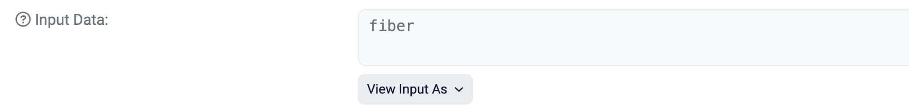
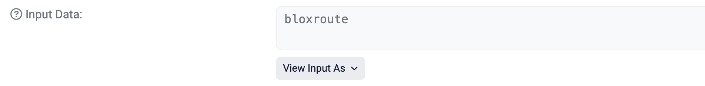
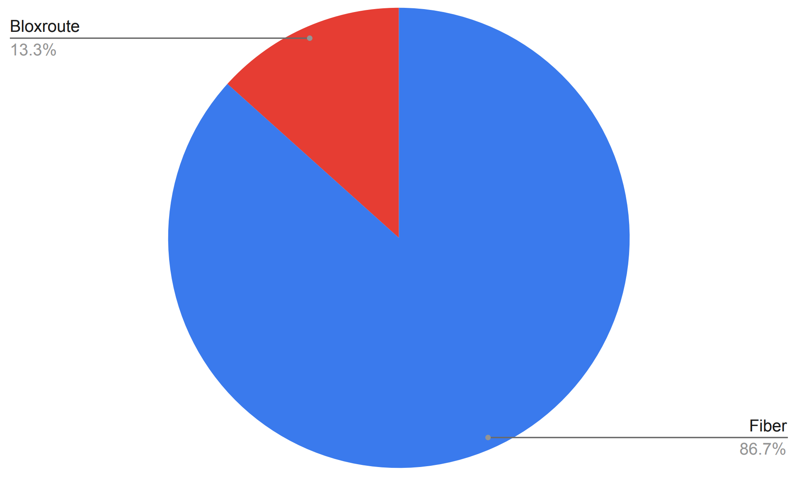
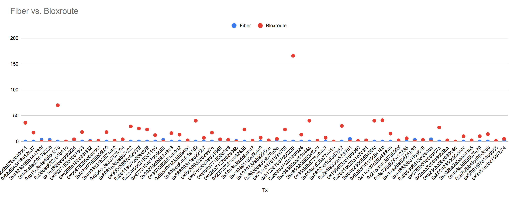

<figure>

<figcaption><sup>Source: https://www.pinterest.com/pin/567242515550180347</sup></figcaption>
</figure>

## Introduction

For the last few months, we’ve been working on a new implementation of Fiber on Ethereum. Fiber is a mempool service that consists of a network of highly optimized nodes. 

Fiber is built with 3 pillars in mind:

- Reliability
- (consistent) Performance
- Resource-efficiency
<!-- truncate -->

These pillars, and the fact that there’s now a new, modular execution client being built by Paradigm ([https://github.com/paradigmxyz/reth](https://github.com/paradigmxyz/reth)) in Rust, made Rust the ideal candidate for the job. And so we set to work. A couple of months later now, and we’ve deployed the new version. 

Bloxroute has been the de-facto mempool service for traders and searchers on Ethereum. Back in December 2020, KeeperDAO (now Rook) ran a [performance benchmark](https://medium.com/keeperdao/a-performance-benchmark-on-mempool-services-9e68bf070952) on Bloxroute, Blocknative and a standard Alchemy node. They found that Bloxroute blew the other 2 out of the water: it delivered transactions first 97% of the time. Since then, there hasn’t really been any new competition, - we aim to change that.

Our [benchmarking tool](https://github.com/chainbound/fiber-benchmarks) consistently shows Fiber seeing a transaction first about 80% of the time, with a median latency difference of 10-12 milliseconds. 

This is the output of the last benchmarking run (1 hour)[^1]:
```
========== STATS =============
Mean difference: 34.81ms
Median difference: 11.00ms
P10 difference: -2.00ms
P25 difference: 3.00ms
P75 difference: 29.00ms
P90 difference: 53.00ms
Max difference: 9311.00ms
Min difference: -81.00ms
Stdev: 273.80ms

========== RESULT =============
Fiber won 81.87% of the time
```
This is great news for Fiber, but seeing a pending transaction first is only one side of the coin. 
In real-world scenarios, HFT players and bots need to capitalize on these opportunities by broadcasting 
a responding transaction as quickly as possible[^2]. 
We therefore decided to measure both listening and broadcasting, to see which service is faster on both fronts.

## Setup
:::info
**Price plans used:**

- **Bloxroute**: Enterprise Plan ($1250/mo)
- **Fiber**: Basic Plan ($500/mo)
:::

To test the services, we’ll set up a classical MEV scenario: the backrun. 

*Backrunning is the act of sending a transaction with the same gas price as some target 
transaction, as fast as possible, which will result in your transaction being ordered right
after the target transaction by the entity putting together the block[^3]. Transactions with 
the same gas price are ordered by arrival time, so latency is extremely important here[^4]. 
Liquidity / NFT sniping, arbitrage and liquidations are all types of backrunning.*

Backrunning will allow us to test 2 interrelated components that a mempool service must 
have separately: **fast transaction delivery** (listening side) and **fast transaction 
distribution** (sending side / broadcasting). The combination of these 2 is what determines 
overall performance. We will establish the backrunning bot on a server in the us-east-1 Virginia 
region, with roughly 1 millisecond latency to both the Fiber and Bloxroute API 
(we’re using the Cloud Websockets API). 
We don’t want last hop latency messing with the results.

Our target transactions (the one we want to backrun), will be broadcast from a couple of different sources: Infura, Alchemy, and a residential node in Belgium. The reason for this is that Infura and Alchemy together originate most of Ethereum transactions, and for the residential node, we’ll see how the services compare for a transaction that comes from somewhere closer to the network edge as opposed to AWS or Google Cloud. It will also show us the internal network latency of both network services: if a transaction originates in Belgium and our bot is in Virginia, a large part of the total latency will be taken up by internal propagation. Since both solutions use AWS, we don’t expect a large difference here, but it could still have an impact. Besides that, we’re also going to be backrunning 30 random transactions, that could come from anywhere.

We’re testing 10 backruns on each RPC node (besides the 30 random ones), to see if we can spot a pattern. The backrun transaction will be sent with the same nonce to both Bloxroute and Fiber, so to differentiate, we’ll input the service name as UTF-8 in the transaction’s calldata. For same nonce transactions, only the first one will be included, while the other will be dropped.

* Fiber: `0x6669626572`

* Bloxroute: `0x626c6f78726f757465`


## Results
:::info
Download the CSV dataset [here](./data.csv).
:::
### Transaction delivery

For delivery time, Fiber was first 52 out of 60 times, 
which is **87%** and roughly corresponds to our benchmark run above.

Let’s take a closer look at transaction delivery time per service. 
The vertical axis is the transaction delivery latency in **milliseconds**. 
The service that first discovered the transaction has a latency of 0, and 
the other value is the difference between the two.

The largest latency difference is **166ms** in favor of Fiber, 
let’s filter it out for now so we can have a better look at the rest of the values:

The above graph shows us that often, it’s a close call, but overall, **Fiber is much closer to the baseline of 0 in all of the cases**. 
The largest difference by which Fiber lost is **5 milliseconds**, compared to 166ms for Bloxroute. 
This shows us that Fiber is faster, and has more consistent performance, 
which satisfies our second requirement.

We don’t find any significant correlation between the differences in delivery time and the RPC node used to 
broadcast the target transaction, which means that both services are pretty well connected globally, and are able to internally propagate transactions quickly.

### Overall performance
**Fiber wins in 54 out of 60 backruns (90% of the time)**

Fiber wins 90% of the backrunning challenges that we set up.

Interestingly, in 2 cases where Bloxroute delivered a transaction first (by 1 and 4 milliseconds), Fiber still won the backrun. This means that in those 2 cases, Fiber’s distribution network was faster.
<figure>

<figcaption><sup>Source: https://wallpapercave.com/w/wp9032145</sup></figcaption>
</figure>

## Conclusion
**A good mempool service tries to tame the chaos and randomness inherent to a global mempool**. This gets harder and harder the more decentralized a network layer is, which is why it’s important to try to cover as much ground as possible. Not just in terms of geographic distribution, but also in connecting to a broad set of peers. With Fiber, we’ve built the technology in a way that allows us to do this for a reasonable cost, which is why we came out ahead. 

Ever since the [Flashbots auction](https://docs.flashbots.net/flashbots-auction/overview) launched, we realize latency on Ethereum mainnet has lost some of its importance. But we decided to build on Ethereum first to prove that we can be faster, and to then expand to other chains (and rollups) to do the same. Check out our [roadmap](https://fiber.chainbound.io/docs/roadmap) for more information.

If you’re interested in trying Fiber out, we have a 5 day refund period. Join our [Discord](https://discord.gg/J4KNdeCYGX) and shoot us a message and we’ll DM you. For now, we offer 2 plans: Basic ($500/mo) and Professional ($1000/mo). The only differentiator between the plans is that with Basic, you can actively listen to only one stream at a time, while you can listen to up to 3 with Professional (from multiple locations). We don’t introduce any artificial latency to the Basic plan. Accessing Fiber can easily be done by using the client libraries we built in [Go](https://github.com/chainbound/fiber-go), [Rust](https://github.com/chainbound/fiber-rs) and [TypeScript](https://github.com/chainbound/fiber-ts). Read more in the documentation [here](https://fiber.chainbound.io/docs/intro).

**Thanks for reading!**

## Footnotes
[^1]: P10/P25/P75/P90 are the percentiles in which each of the latency difference observations fall. Negative means that Bloxroute was faster. For example, P10 is -2ms, which means that for the lowest 10% of observations, Bloxroute was faster by >2ms.
On the other hand, a P90 value of 53 means that 10% of the transaction where delivered by Fiber first with a difference of more than 54 milliseconds.
[^2]: Unless they decide to use a private mempool like Flashbots.
[^3]: Assuming neither the backrun transaction or the target transaction is reordered due to being included in a bundle.
[^4]: Go-ethereum code: [go-ethereum/core/types/transaction.go#L53](https://github.com/ethereum/go-ethereum/blob/645e3e86c45bfb726b507e661f788baa85d0249f/core/types/transaction.go#L531). Note that for type 2 transactions, the order is determined by the priority fee.

